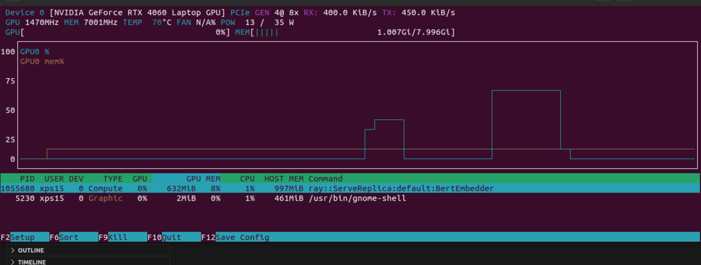

# Ray-Serve-Bert
This repo contains example and explanation for setting up Ray Serve in Nvidia RTX4060 GPU.

To run this example, there needs to be two terminals, one for server, one for client.

## Server terminal

Run server:

```
./run_ray_local.sh
```

## Client terminal:

Run single client with single observation or input:

```
./single-client.sh
```

Alternatively, run batch observations:

```
./batch-client.sh
```

Output will be embedding returned by the BERT base model.

## Ray application

ONce Ray Server is started, there willbe these informations shown:

```
========================================================
Starting Ray Serve...
-> Inference Endpoint will be at: http://127.0.0.1:8000
-> Ray Dashboard will be at:      http://127.0.0.1:8265
========================================================
```

Ray Dashboard will be available for monitoring the GPU node and application performance.

## Benchmark

Run benchmark program in the following configuration:

1. To test 1,000 total request simulating 50 concurrent users:

```
python benchmark.py --n 1000 --c 50
```

and the benchmark will be shown:

```
Total requests: 1000, Concurrency: 50, Batch Size (per request): 1
==================================================
BENCHMARK RESULTS
==================================================
Total Requests: 1000
Successful:     1000
Failed:         0

--- Latency (ms) ---
Min:    90.57 ms
25th:   145.57 ms
Median: 171.24 ms
Average:179.80 ms
75th:   205.00 ms
Max:    388.54 ms

--- Overall Throughput ---
Total Time:      3.65 s
Requests/second: 273.83

--- Throughput Distribution (Reqs/sec over 1s windows) ---
Min:    214.00 reqs/s
25th:   255.00 reqs/s
Median: 296.00 reqs/s
Average:269.67 reqs/s
75th:   297.50 reqs/s
Max:    299.00 reqs/s
```

Above is a typical run.

2, To test batching capability by launching 500 requests mapping to arrays of 10 texts each (with 25 concurrent users):

```
python benchmark.py --n 500 --c 25 --batch-size 10
```

and the results will be shown:

```
Total Requests: 500
Successful:     500
Failed:         0

--- Latency (ms) ---
Min:    160.80 ms
25th:   496.36 ms
Median: 520.00 ms
Average:518.98 ms
75th:   541.44 ms
Max:    669.73 ms

--- Overall Throughput ---
Total Time:      10.55 s
Requests/second: 47.37
Items/second:    473.74

--- Throughput Distribution (Reqs/sec over 1s windows) ---
Min:    43.00 reqs/s
25th:   44.25 reqs/s
Median: 46.50 reqs/s
Average:46.80 reqs/s
75th:   48.75 reqs/s
Max:    51.00 reqs/s

--- Throughput Distribution (Items/sec over 1s windows) ---
Min:    430.00 items/s
25th:   442.50 items/s
Median: 465.00 items/s
Average:468.00 items/s
75th:   487.50 items/s
Max:    510.00 items/s
```

These results are gnerated from a typical run.

### GPU activity

Either one will output detailed readout breaking down the metrics: min, 25th, median, 75th, max and average on both connection Latency and Requests-per-Second. And the GPU activities are shown with `nvtop`:



